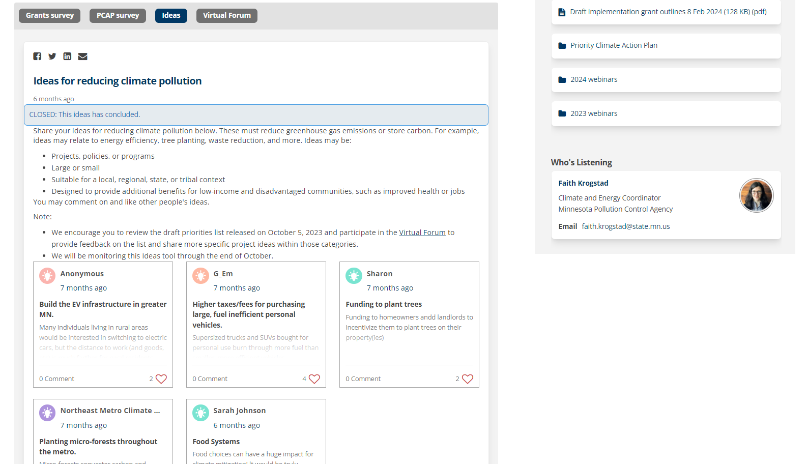

# Intro: Science Communication & Public Engagement


As researchers trained at the intersection of technical communication
and the rhetoric of science, technology, and medicine, we have thought a
lot about the boundaries of scientific communication, technical
communication, and science communication.

## Communication: Science, Scientific, and Technical

Science communication is commonly understood as communication aimed at
non-expert audiences such as the general public, policymakers, and
media, with the goal of making scientific knowledge accessible,
enhancing public understanding of science, and influencing
decision-making. Prototypical examples of this include Neil DeGrasse
Tyson's StarTalk radio program, which discusses complex astronomical
phenomena in an engaging way; public science museum exhibits, like those
about paleontology that visually explain the prehistoric world; and
articles in publications like Scientific American that address current
scientific issues such as climate change for broader audiences.

Scientific communication focuses on communicating with peers within the
scientific community to advance science through the sharing of research
findings and discussion of theories. Typical forms of scientific
communication include peer-reviewed research articles that detail new
studies and discoveries, presentations at scientific conferences where
researchers share and discuss their work, and academic posters that
succinctly present research findings at gatherings of experts.

Technical communication is designed for both specialized and
non-specialized audiences, aiming to make specialized information or
technology comprehensible and usable. This can include detailed
instruction manuals that guide users through the setup and use of
devices, comprehensive reports that communicate the results and
implications of technical assessments, and thorough documentation such
as software user guides or API documentation, which are essential for
understanding and effectively utilizing technology.

|                          | Audience                                                                       | Purpose                                                                                                                      | Prototypical examples                                                                                                                |
|--------------------------|--------------------------------------------------------------------------------|------------------------------------------------------------------------------------------------------------------------------|--------------------------------------------------------------------------------------------------------------------------------------|
| Science Communication    | Non-expert or general audiences, including the public, policymakers, and media | Make scientific knowledge accessible; enhance public understanding of science; inform decision making                        | Neil De Grasse Tyson\'s StarTalk; Public science museum exhibit about paleontology; Scientific American article about climate change |
| Scientific Communication | Peers in scientific community                                                  | Advance science by sharing research findings, discussing theories                                                            | Peer-reviewed research articles, conference presentations, posters                                                                   |
| Technical Communication  | Specialized or non-specialized users                                           | Make specialized information or technology comprehensible and usable; use technology to communicate specialized information  | Instructions, reports, documentation                                                                                                 |

: Conventional understandings of science, scienctific, and technical
communication {.striped .hover .bordered}

While these conventional understandings surely have some utility, the distinctions they rely on are often vague in practice. For example, consider the distinction between scientific knowledge and specialized information: are the media, policymakers, and citizens not users of the evidence science produces? Does making that specialized information comprehensible and usable constitute science communication or technical communication? 

Consider also the notion of peer, specialized, or technical audiences: At what point are researchers in adjacent disciplines or non-academic organizations no longer peers? Are research articles published in the Journal of Environmental Management, written by ecologists and read by both environmental economists and government natural resource managers, scientific communication or science communication?

Finally, consider definitions of technical communication that hinge on the use of technology: Does the use of communication technology to make information comprehensible and usable position both scientific and science communication as also forms of technical communication?

The bounds of science itself are notoriously difficult to draw (take our word for it or type “demarcation problem” in your search engine of choice), and we believe the same is true for technical, technology, and expert. Fortunately, our goal is not to resolve these problems but rather simply to muddy the waters enough to suggest that: 1) public engagement with policy making is a site of science communication, broadly construed and 2) this communicative practice is also productively viewed through the lens of technical communication.

## Science Communication in/and/as Public Engagement

Public engagement in policy making may on its face appear to have little connection to science communication as it’s often understood, so in this section we briefly articulate two ways we see public engagement as relevant to science communication. 

### What is public engagement?

For our purposes here, public engagement refers to the processes and mechanisms by which the public participates in democratic policy- or decision-making. Public engagement as we define it here can be informal or informal and optional or mandated. Scholars in a range of fields as well as government practitioners use various terms to describe both public (civic, community, stakeholder, citizen) and engagement (participation, involvement, inclusion, consultation), but generally speaking these are all efforts to improve the transparency, legitimacy, and quality of government decisions through dialogue between decision makers and those affected by the decisions they make [@moore2017].

In other words, we might see public engagement processes as attempts to enact the ideals of deliberative or participatory democracy, where participation and dialogue are understood as central to good decisions. 

### PE as a site of science communication

William Keith and Robert Danisch [@keith2014] argue that for Dewey and Deweyans, science and democracy are flip sides of the same coin. “Science, properly understood, is a democratic enterprise, and democracy is a scientific one” (2014, p. 34). Taken together, these notions of science and democracy lead directly to Dewey’s search for “social democracy”-- a “search for the practical and intellectual conditions in which appropriate and timely communicative acts can guide public deliberation, and where public deliberation simultaneously considers both ends/values and means/technologies/knowledge (2014, p. 28).

To make this point, Keith and Danisch distinguish between science~1~ and science~2~:

* science~1~: “the professional practices of those who pursue knowledge, not so much for its own sake but as a professional occupation: scientists, whether ‘laboratory’ or field scientists or even social scientists (p. 35).
* science~2~: “a variety of practices having a strong family resemblance to professional science and its epistemology… [that constitute] a reflective and systematic practice of responding individually or corporately to perceived problems” (p. 35)

Following Keith and Danisch, public engagement is at the very least a process in which the results of science (science~1~) are communicated to a broader group of stakeholders so that it may inform their action. Put another way, public engagement with policy making is a site in which relevant science is communicated to those involved in making policy with the goal of informing decision making. Indeed, scientists themselves often participate in these processes when their expertise or research are in some way relevant to the decision or policy in question.

More radically, we might also view deliberation properly understood as scientific (science~2~)-- as a process of inquiry where we collectively and systematically define problems and put what we know to work in an attempt to address them. Here, policy makers and other stakeholders are engaging in communication as part of a scientific process. Rather than address problems based on a limited definition of the problem and view of the relevant evidence, they engage in a deliberative process to collectively define the problem, recruit and weigh evidence, and subsequently design an intervention. In this view, the science in science communication is expanded beyond the common view of scientists as folks in white lab coats or even those whose profession primarily involves research. Rather, science is expanded to include problem-solving activities, activities that from a Deweyan perspective are properly viewed as scientific when pursued in ideal conditions.

In the two cases of public engagement that follow, science~1~ plays a critical role. In the first case, decision makers and other participants must consider what ecologists say about the effects of light and noise on local species when determining the impacts of building a currency production facility. In the second case, deciding how to mitigate the effects of climate change by reducing greenhouse gas emissions requires that decision makers know what contributes to current emissions levels and how different actions are likely to influence those levels, both of which are questions that professional scientists in range of disciplines have weighed in on. And through the lens of science~2~, the decision makers themselves are engaged in science and science communication to the extent that they are trying to systematically define and address a social problem.


# Case 1: Bureau of Engraving and Printing Facility


Two facilities currently manufacture U.S. currency: one in Fort Worth, Texas, built in 1990, and another in downtown Washington, DC, constructed in 1914. The Bureau of Engraving and Printing (BEP)--a government agency within the U.S. Department of the Treasury-- operates both facilities. Citing the need to modernize production and increase efficiency and worker safety, BEP has been pursuing either a significant renovation to the 100+ year-old DC facility or a replacement facility in the capital region for over a decade. After studying alternatives, BEP proposed to build a new facility in the Beltsville Agricultural Research Center (BARC) in nearby Beltsville, MD.

The BEP proposal is one of tens of thousands of federal actions taken each year that are subject to the National Environmental Policy Act (NEPA), which mandates that actions with potentially significant impacts on the quality of the human environment must undergo comprehensive study and documentation through an environmental impact statement (EIS). As outlined by NEPA, there are essentially two phases of public engagement -- during the scoping period and while preparing the EIS. 

## Project website

Before describing these specific phases and their supporting artifacts, we want to draw attention to the [project website](https://www.nab.usace.army.mil/BEP/), which went live at the outset of the project to provide an ongoing site of engagement [@zotero-10584]. The project site is a single page with no navigation bar, but has many subsections designed to provide additional context and links to supporting information. For example, there is a section on public scoping that includes links to the public scoping report and digital versions of the presentation slides, posters, and factsheets that were used during scoping. Information about the current phase of the project is featured prominently at the top, along with links to the materials most relevant to that phase. For example, during the comment period on the DEIS links to the digital EIS and virtual reading room were prominently featured at the top of the landing page. In total, the project page currently features well over 100 links organized around six major sections, some of which feature collapsible subsections.

In late 2019, BEP initiated the scoping process, presenting the proposed action and identifying issues of concern. Interested parties and stakeholders were invited to learn about the project via a public scoping presentation, posters, and fact sheets and to ask questions or leave comments on environmental issues and concerns (e.g., air quality, traffic and transportation, socioeconomics and environmental justice) associated with the proposed action. Public input from the scoping period is considered and addressed during the preparation of the EIS and summarized in the public scoping report. 

Following the publication of the DEIS in late 2020, BEP held a 45-day public review and comment period. During this period, the public could submit comments about the proposed action, alternatives, potential environmental impacts, and recommended mitigation measures via mail, email, on the project website, or at the public webinar.  Engagement during EIS preparation was supported by numerous artifacts including a digital EIS, a virtual reading room of draft EIS materials, and a traditional written EIS. In addition, a webinar was held via WebEx about half way through the review period. Upon close of the comment period, the agency considers all “substantive” comments and, if necessary, conducts further analyses. A final EIS, which provides responses to substantive comments, was published in June 2021. There was then a 30-day period for the public to review the final EIS before the record of decision was published in October 2021.

Although the digital EIS and the virtual reading room were billed as COVID accommodations, press releases and white papers promised that these VR- and GIS-driven tools are the future of NEPA-mandated public participation: “These modern technologies reduce internal NEPA review times, increase meaningful public involvement, improve agency decision making, and focus on improved environmental outcomes, while achieving the proposed action’s purpose and need.” In the sections that follow, we will provide a tour of these emerging digital tools, examining their functionalities and impact on public engagement within environmental decision making. 

## Virtual reality reading room

One of the digital tools that supported public engagement during EIS preparation was a VR-based “virtual reading room.” This tool is visually laid out to replicate the open house-style poster session that it replaced. It’s essentially a series of topical one-page summaries, with links to supporting materials and ways to submit a comment.


After clicking the link on the project website, the user/viewer is taken to the virtual reading room. The room has skylights, brick walls, and wooden floors. Virtual people of varying ages and races and wearing primarily professional attire are positioned throughout the room, looking at the ten large posters that ring the edge of the room. The posters are numbered sequentially, with the first “welcome” poster having a pulsing “start here” icon above it. The user can click on the posters, which enlarges them and displays them as a one-page PDF on the screen. In the PDF view, the user can click to advance through all the posters. The user can also exit the PDF view and rotate the virtual room to navigate to a specific poster.

In the center of the room is a table with three clickable objects sitting on it. On the right, is a laptop that takes the user to the digital EIS. In the middle, is a paper booklet that takes the user to the traditional draft EIS. On the left are three black filing boxes that take the user to technical memoranda.

Between the first and last posters, there is a large touch screen for people to interact with to submit a comment. When the user clicks on it, they are presented with three options for providing feedback. The user can click on the first button to email a comment. The second button allows the user to provide a comment through the project website. The third button allows the user to download a comment form.


## Digital EIS

Another central digital tool that supported public engagement during EIS preparation was a GIS-driven “digital EIS.” This tool modularized the written EIS, and supplemented it with interactive maps. It has a similar look to Esri's "story maps."


The landing page for the digital EIS provides high level data on the right half of the screen and photos of the current and proposed sites on the left. Clicking the start button takes the user to the abstract. In general, the digital EIS is organized in the same way that a traditional EIS is (e.g., executive summary, purpose, need, proposed actions, alternatives, resource analyses). In the text on the right side of the screen, there are internal links that let the user drill down on specific topics and connect to the traditional EIS and other project documents. As the user scrolls through the text on the right side of the screen, the visuals on the left side change. These visuals include photographs, GIS-maps, drone videos, and analytics.


# Case 2: Minnesota Climate Action Planning


Our second case focuses on the Minnesota Pollution Control Agency's
(MPCA) efforts to design and fund a climate pollution reduction project.
As part of the Inflation Reduction Act, the U.S. EPA's Climate Pollution
Reduction Grants (CPRG) program is a \$5 billion investment that
provides states, local governments, and Tribal Nations with resources to
implement projects that reduce greenhouse gas emissions and other
harmful air pollution [@zotero-10578]. In collaboration with other state
agencies and stakeholders, the MPCA secured a planning grant in June
2023. The deliverables for this grant included a "Priority Climate
Action Plan" that provides "a focused list of near-term, high-priority,
implementation-ready measures to reduce climate pollution from
greenhouse gas emissions" [@kohlaschb, p. 8]. 

The PCPA includes a list of projects the agency would be ready to
implement. Submitting the plan made the MPCA eligible to apply for an
implementation grant, which would provide funding for one or more
projects identified in a Priority Climate Action Plan.

The MPCA's process for writing that action plan is our focus in this case. 


More specifically, we focus on the MPCA's engagement activities as implemented via a [project-specific EngagementHQ webpage](https://engage.eqb.state.mn.us/climate-priorities) dedicated to "identifying priorities for federal climate funding".   

## Engagement HQ

EngagementHQ is a digital platform designed primarily for use by
government agencies. The "all-in-one digital engagement platform"
consists of a suite of features designed to help agencies design and
manage community engagement activities. Product descriptions and case
studies of EngagementHQ emphasize its ability to promote two-way
dialogue, using phrases like deliberative dialogue, open discussion,
civil debate, conversation, co-design [@2021].

EngagementHQ serves as something akin to a content management system
where government communicators can design and facilitate communication. 

Agency communicators can provide valuable project context on the landing
page for the project. In this case, the landing page serves as a hub for
the Minnesota Pollution Control Agency's efforts to secure a Climate
Pollution Reduction Grant from the Environmental Protection Agency.

The top of the landing page features text describing the details of the
grant program, what the agency has already done, and what will happen
next in the project. At the end of this text readers are invited to sign
up for email updates about the project or email a coordinator directly
if they have questions. Links to share the page via email or popular
social media platforms are also featured.

To the right, a graphic representation of the project lifecycle lists
phases of the project and the estimated timeframe for each phase.
Checkmark icons indicate which phases have been completed.


Together, the project overview text and lifecycle panel provide
high-level project context to orient participants.

A files repository allows government communicators to provide in depth
information and additional background. A files panel below the project
lifecyle features a list of materials including video recordings and
associated slides from a series of webinars in which project
facilitators provided project information and answered participant
questions. 


These webinars serve as a digital alternative or supplement to public
meetings where project facilitators might brief community members on the
project and seek input. In this case, these webinars serve as key moment
to frame subsequent engagement around a set of shared, salient facts.


In addition to providing data, the agency directs participants to data sources they believe will be compelling to the funding agency. For example, they note that the EPA reviewers expect projects to have a positive impact on disadvantaged communities, as defined by [Justice40 Initiative criteria](https://screeningtool.geoplatform.gov/en/methodology) and the Inflation Reduction Act's Disadvataged Communities Map [@zotero-10588; @usepa2023]. 

Participants are directed to access maps of disadvantaged communities in Minnesota via EJScreen, the EPA's Environmental Justice Screening and Mapping Tool [@zotero-10590]. 


```{=html}
<iframe src="https://ejscreen.epa.gov/mapper/" title="EJScreen: Environmental Justice Screening and Mapping Tool" width="100%" height="500" style="border:none;"></iframe>
```


Additional files are added throughout the project, such as an outline of potential ideas early in the project and a draft of Priority Climate Action Plan.   

## Survey

The team uses the survey feature to collect data on values and
preferences to ostensibly inform which projects they move forward with
and provide empirical support for those choices. The Climate Pollution Reduction Grant team opened a survey to gather project ideas within the priority categories they identified. As the team articulates in the final Priority Climate Action Plan, this survey "garnered over 350 submissions from local governments, community-based organizations, state agencies, academic institutions, businesses, and interested individuals, spanning from general ideas to detailed project proposals...these helped inform the measures that are now integrated into the PCAP" (p.17, @kohlaschb). 

## Ideas board

Some of the features in EngagementHQ explicitly promote dialogue between
government communicators and participants, but also enable dialogue across participants. 



The team used an "ideas board" to invite participants to share their ideas for reducing greenhouse gas emissions. Unlike a survey response that goes directly to the CPRG team, short "ideas" are posted to the board become cards in a grid for other participants to read, like, share, or respond to.  

## Forum board

The team also used a "forum board" to invite participants to share ideas. While the prompt is similar to the ideas board, this format is presumably better suited for more involved posts. 


Here again, participants are able to respond to others' posts.

Overall, we see the MPCA use the features of EngagementHQ to not only to provide participants with information in a variety of formats but also to facilitate exchange among participants.  


# Discussion


While science communication is often discussed as an effort to make complex, science-y things more approachable for "lay" audiences, we might instead view science communication as essentially an effort to make what an expert community knows available and actionable for those outside that expert community. This view shifts the audience of science communication from passive receivers of information to active participants with goals. In so doing, this perspective brings science communication closer to the realm of technical communication, where the primary focus is not merely on making information accessible, but on making it useful for people with problems to address or tasks to complete. 

In the two cases of public engagement we’ve discussed, digital tools seem designed to provide stakeholders with additional ways to access information. In a broad sense, these artifacts certainly allow more people to access project information and subsequently participate in the decision-making process than physical meetings alone. For example, as a web-based artifact, BEP’s digital EIS makes use of linking to provide access to a wealth of data; it also makes use of GIS to incorporate information-rich, interactive maps that are not typically part of traditional EISs. Relevant agencies and representatives at the state and local levels are likely to appreciate having access to all that data alongside the modularized written content that the digital EIS provides. For non-expert participants, the visual format might be easier to engage with than a 100-1000 page technical report. Indeed, the infrastructure firm that designed the platforms for both the digital EIS and virtual reading room says the technologies will improve stakeholder engagement by “presenting highly technical information in a user-friendly online and interactive format…[leading] to improved outcomes for communities worldwide” [2].

But a closer look at the events and artifacts that make up these periods of public engagement (e.g., the webinar, the virtual reading room, the reports to be reviewed) suggest primarily one-way conversations in which information is being delivered. For example, consider the virtual reading room: an online, interactive space that visually approximates a poster session (see figure X). Created as part of an effort to provide “stakeholders with a safe and effective way to understand the proposed project and provide input despite social distancing requirements,” the virtual reading room is visually rich, available 24/7 with internet access, and mobile-friendly [3]. While the amount of information a viewer has access to is extensive, it doesn’t replicate the most important function of a poster session or open house -- dialogue with humans. The use of forums and idea boards in EngagementHQ have more potential to facilitate dialogue. Rather than provide participants with a digital comment box, these tools allow agency managers to create a space where participants can share information and express preferences not only to the agency but also to fellow stakeholders. 

St. Amant argues that advocacy is at its core about access to information, but suggests that we think about access to information as involving two interlocking parts: “The first is availability-- that is, the sources of information are available for us to consult as needed… the second concept is comprehensibility-- or information is presented in a way we can easily understand and act on” [5]. In this, St. Amant positions technical communicators as ideal individuals to foster advocacy by designing materials and conveying highly technical information to a range of audiences. 
TC scholars Moore and Elliot (2016) suggest that public engagement in the context of public planning projects be viewed not only as participatory design but also as a critical opportunity for planners to collect data to inform the design of the final project. They advocate viewing engagement processes like the ones discussed here as efforts to design “listening infrastructures.” Public engagement is often viewed as being more about questions of value than questions of value and action than questions of fact-- place of politics, not science. We contend that both planners and participants make and contest arguments about what we ought to do based on the questions and answers of science. Further, Moore and Elliot’s contention that public engagement is at least in part about gathering data of participants values, preferences, and tacit knowledge positions the entire process as science2-- as doing democracy scientifically. 

In a subsequent article, Moore (2017) advances a vision of the technical communicator as participant, facilitator, and designer. Following Moore, we contend the engagement planner-as-technical communicator is tasked with not only providing participants with relevant scientific information, but also with designing a space in which relevant science can effectively inform decisions. 


# Conclusion


# References